# UNIX-02-SIN-A-Mar-Jul-2026
Repo for intro to UNIX
1.
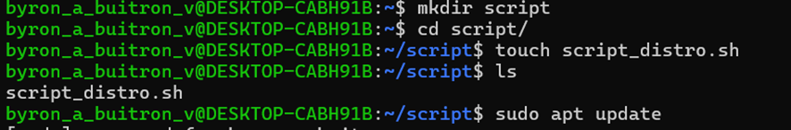
2.
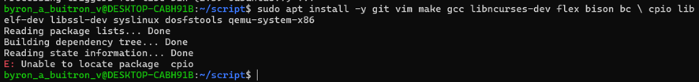
3.
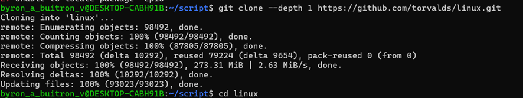
4.
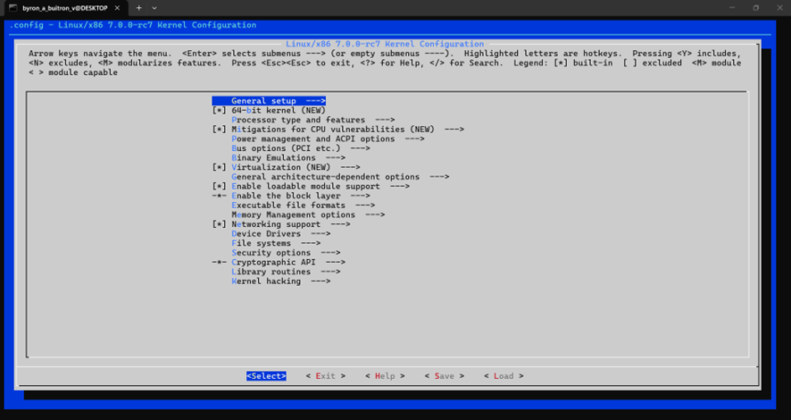
5.
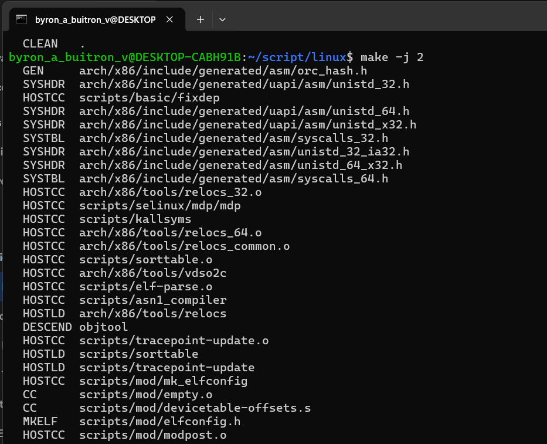
6.
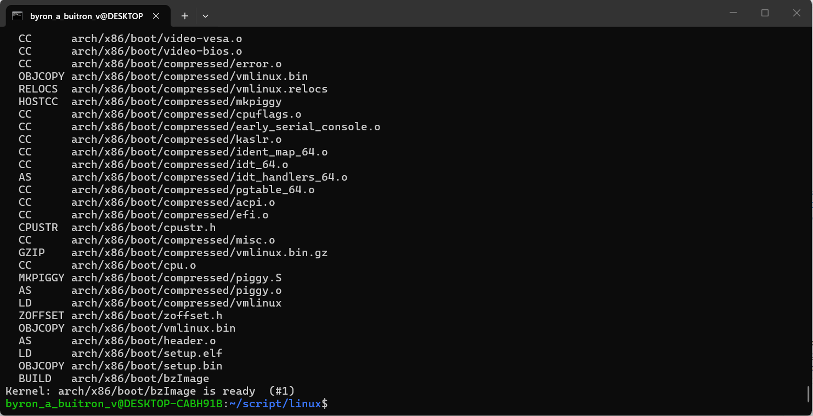
7.
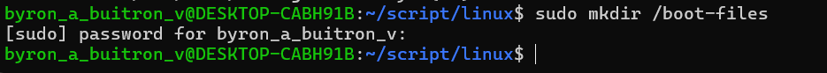
8.
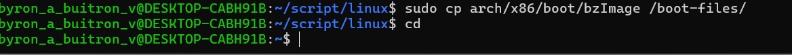
9.
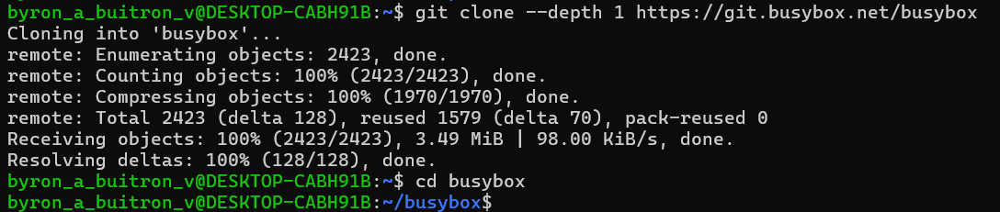
10.
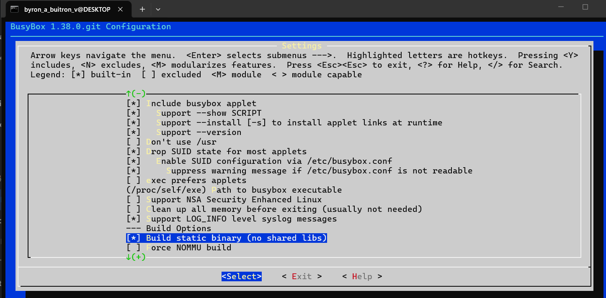
11.
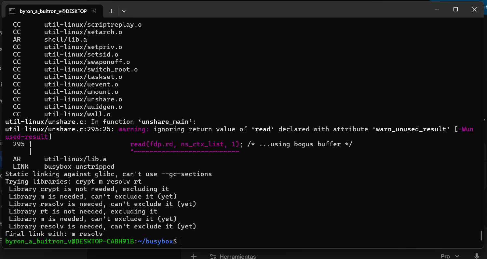
12.
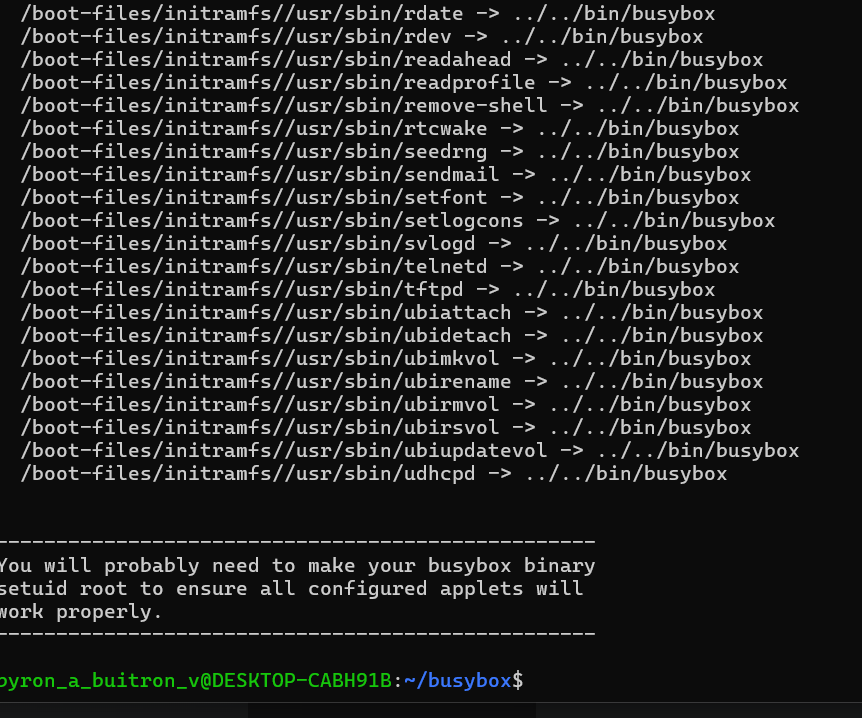
13.
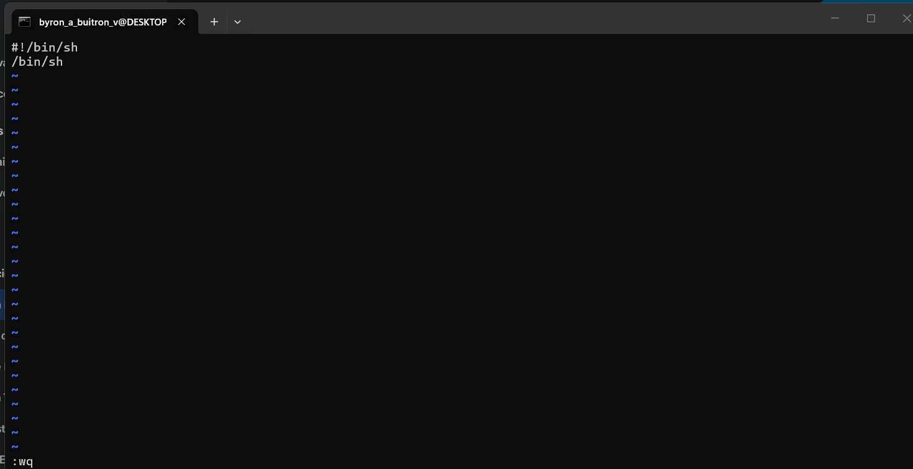
14.
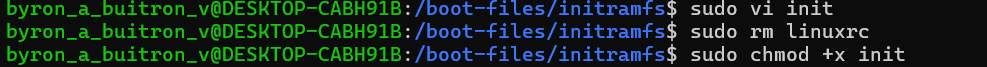
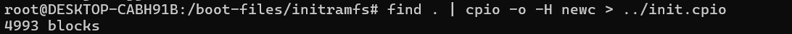
15.
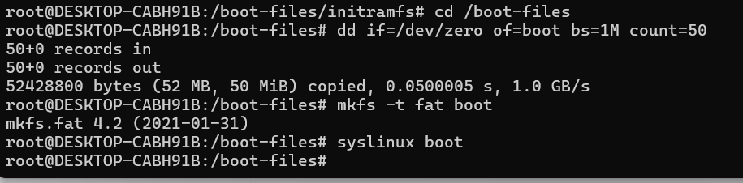
16.
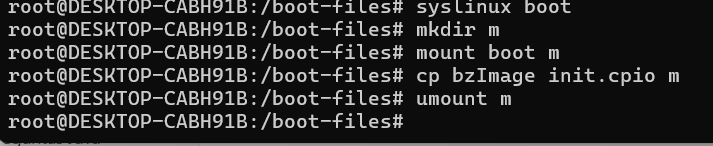
17.
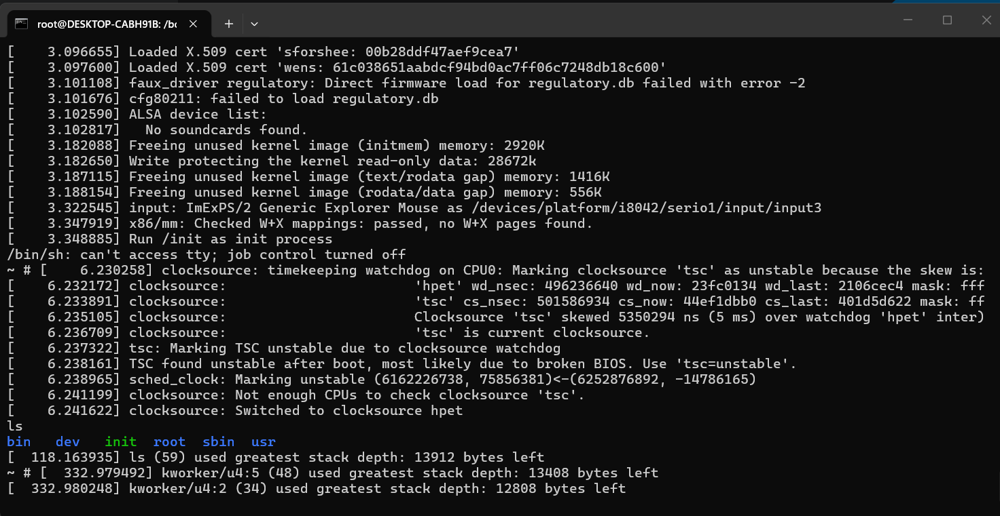
18.
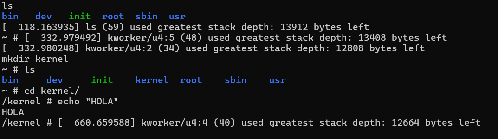
EXERCISES
1. Check the firmware type: Run [ -d /sys/firmware/efi ] && echo “UEFI” || 
echo “BIOS” both in the Codespace and within QEMU. What result do you get, and why?
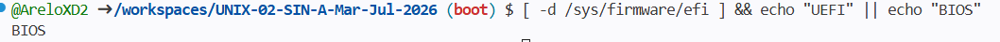
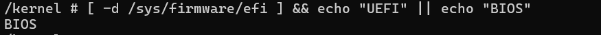
When running the boot path check in QEMU and in the terminal environment, the result in both cases is “BIOS.” This happens because QEMU boots by default using SeaBIOS, a traditional firmware emulator, which prevents the kernel from detecting a modern environment and creating the /sys/firmware/efi directory in memory.

The architecture of this system uses a classic boot (MBR), since “Syslinux acts as our bootloader” (Project Guide, n.d., p. 7) and requires a conventional FAT partition to operate. Similarly, cloud development environments simplify their initialization by emulating this traditional boot rather than exposing a full UEFI interface.

2. Inspect the structure: Inside QEMU, run ls / and compare it with the directory structure we saw in class. Which directories are missing and why?
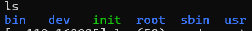
Based on the screenshot, standard Linux directories like /home, /etc, /var, /proc, /mnt, and /sys are missing. The output only shows a minimal structure (bin, dev, root, sbin, usr, and the init script). This happens because the system is running entirely from the initramfs, which is just a "mini sistema de archivos temporal cargado en RAM". Since the custom distribution never executes the step of "montar el sistema real", it lacks the full directory hierarchy required for a complete operating system.

3.Explore BusyBox: Inside QEMU, run ls -la /bin/ and observe that all commands are symbolic links to the same binary. What advantage does this have for an embedded system?
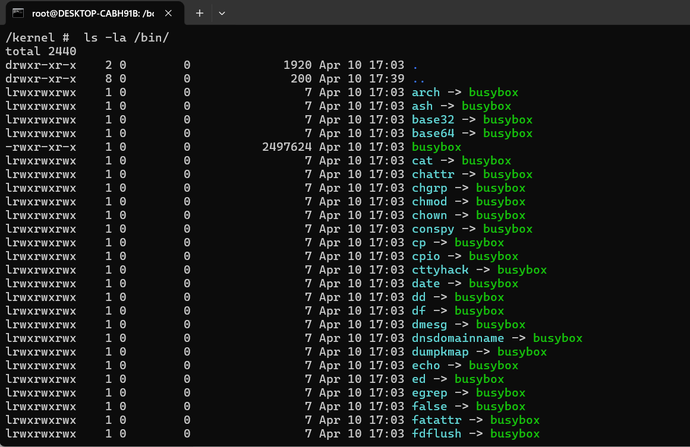
The main advantage is massive storage and memory optimization. Instead of storing hundreds of separate executables for each standard Unix command (like ls, grep, or mkdir), the system only needs one single, highly compressed binary (busybox). The symbolic links simply act as shortcuts pointing to this core file. This drastically reduces the disk footprint and RAM usage, which is absolutely essential for embedded systems, routers, or IoT devices with severely constrained hardware resources.

4.Examine blocks: In Codespace, create a file using `echo “hello” > test.txt`, and then run `stat test.txt`. Compare the actual size to the allocated blocks. Is there internal fragmentation?
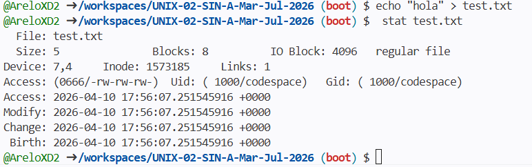
Based on the screenshot, the actual size of the file (Size) is only 5 bytes, which corresponds perfectly to the four letters of the word "hola" plus an invisible newline character. However, the command output shows that the system allocated 8 blocks for this tiny file, operating with a standard input/output block size (IO Block) of 4096 bytes.

This result clearly demonstrates that there is internal fragmentation. Operating systems allocate disk space in fixed-size chunks to optimize hardware reading and writing operations. Since the file system reserved a full 4096-byte block for a file that only required 5 bytes, the remaining 4091 bytes inside that block are completely wasted and unusable by other processes.

5.Analyze partitions: Run sudo parted -l && echo -e "\n---\n" && lsblk -f in the Codespace. Identify which disks use GPT vs MBR, and what filesystems are in use.
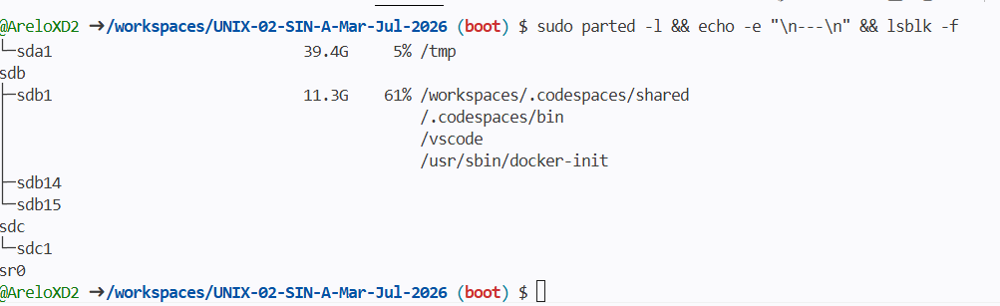
By scrolling up to the parted -l section of the output, I can identify the partition scheme under the "Partition Table" field for each disk. Disks labeled as msdos utilize the older, traditional MBR (Master Boot Record) format, while those designated as gpt use the modern GPT (GUID Partition Table) standard, which is typically used for primary virtual drives in cloud environments.

In the lsblk -f section shown in the screenshot, the block devices (like sda and sdb) and their mount points (such as /workspaces) are displayed. If you expand the view to see the FSTYPE column, you will predominantly find ext4 being used as the main Linux filesystem for these partitions, providing robust storage for your project files, often alongside vfat for standard boot sectors.